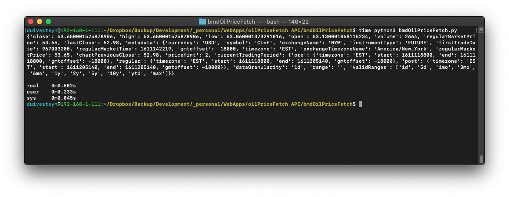

# bmdOilPriceFetch

A **Fast** and **Efficient** way to get the **current** Oil Price from Yahoo Finance API in Python. Data is returned as a dictionary. 

I've found a lack of good simple ways to get the oil price from a free online API, so I designed one myself based upon Yahoo Finance. 

It simply returns a dictionary with the current market data for Oil (by default).

# Example Usage
An example usage file is included called getPrice.py. It consists of the following:

    from bmdOilPriceFetch import bmdOilPriceFetch
    import pprint

    data = bmdOilPriceFetch.main()
    pprint.pprint(data)

# Example OuptutData
The output is a dictionary:

    {'close': 53.650001525878906, 
    'high': 53.650001525878906, 
    'lastClose': 52.98, 
    'low': 53.060001373291016,
    'open': 53.130001068115234,
    'regularMarketPrice': 53.65,
    'volume': 2664,
     'metadata': {'chartPreviousClose': 52.98,
              'currency': 'USD',
              'currentTradingPeriod': {'post': {'end': 1611205140,
                                                'gmtoffset': -18000,
                                                'start': 1611205140,
                                                'timezone': 'EST'},
                                       'pre': {'end': 1611118800,
                                               'gmtoffset': -18000,
                                               'start': 1611118800,
                                               'timezone': 'EST'},
                                       'regular': {'end': 1611205140,
                                                   'gmtoffset': -18000,
                                                   'start': 1611118800,
                                                   'timezone': 'EST'}},
              'dataGranularity': '1d',
              'exchangeName': 'NYM',
              'exchangeTimezoneName': 'America/New_York',
              'firstTradeDate': 967003200,
              'gmtoffset': -18000,
              'instrumentType': 'FUTURE',
              'priceHint': 2,
              'range': '',
              'regularMarketPrice': 53.65,
              'regularMarketTime': 1611142219,
              'symbol': 'CL=F',
              'timezone': 'EST',
              'validRanges': ['1d',
                              '5d',
                              '1mo',
                              '3mo',
                              '6mo',
                              '1y',
                              '2y',
                              '5y',
                              '10y',
                              'ytd',
                              'max']}
    }

# To do

* Enable importing as an Object
* Create as a package

# Credits

designed in 2021 by bmd.

# Changelog

* v0.1  2021-01-20  Initial Revision. Execution Time around 500ms. Code= 47 Lines